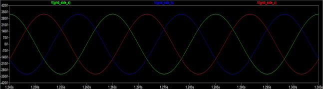
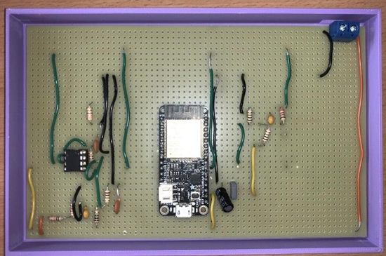

# ESP32 Grid Monitoring RTU Proxy

An ESP32-based Remote Terminal Unit (RTU) proxy designed for real-time wind farm substation monitoring. This system bridges physical grid telemetry with master SCADA architectures via the DNP3 protocol. 

The architecture utilizes a dual-core design to decouple asynchronous network operations from high-speed, deterministic analog signal processing.

---

## 🖥️ SCADA & HMI Interface

The local Human Machine Interface (HMI) provides operators with zero-latency physical status verification, maintaining operational visibility independent of upstream wide-area network (WAN) connectivity.


### Core Metrics:
* **Three-Phase Parameters:** Calculates RMS voltage, current, and phase angles.
* **Grid Frequency:** Monitored via high-resolution timers to catch deviations ($\pm 0.01\text{ Hz}$ resolution).
* **Telemetry Diagnostics:** Tracks DNP3 link-layer states, polling frequencies, and network fault logs.

---

## ⚡ Analog Signal Conditioning Front-End

A custom analog front-end interfaces the single-ended 3.3V ESP32 internal ADCs with industrial instrumentation transformers (CTs/PTs). The circuitry steps down AC grid voltages, introduces a stable +1.65V DC bias offset, and acts as a second-order anti-aliasing low-pass filter.

### Circuit Schematics (LTSpice)
Configurations were validated for low phase distortion and thermal stability across single-channel and multi-input multi-output (MIMO) topologies.

| Single-Channel Conditioning Circuit | LCL Filter MIMO Conditioning Circuit |
| :---: | :---: |
|  |  |

### Simulation & Verification
Frequency and transient response simulations verify wave-shape integrity before digitization.
* **Frequency Domain:** Bode analysis confirms a flat response across nominal operating frequencies (50/60 Hz) alongside high-frequency harmonic attenuation.
* **Transient Analysis:** Confirms phase-aligned, balanced voltage waveforms mapped strictly within the safe 0–3.3V ADC input thresholds.

| Bode Plot Analysis | LCL Filter Output Waveform | Three-Phase Voltage to ADC Output |
| :---: | :---: | :---: |
|  |  |  |

---

## 🛠️ Hardware Prototyping

Physical prototypes were built on rugged stripboard layouts to validate signal integrity, EMI resilience, and component placement under thermal loads.

| SISO Stripboard Prototype Build | MIMO Stripboard System Build |
| :---: | :---: |
|  |  |

---

## 📂 Repository Structure

```text
├── docs/               # Technical dissertation, design criteria, and analytical logs
├── hardware/           # Schematics, BOM, component datasheets, and LTSpice files
├── hmi/                # Display assets, configuration files, and localized UI codebase
├── src/                # ESP32 Core firmware (DNP3 outstation stack, ADC sampling, DSP)
└── images/             # System documentation and visual assets
