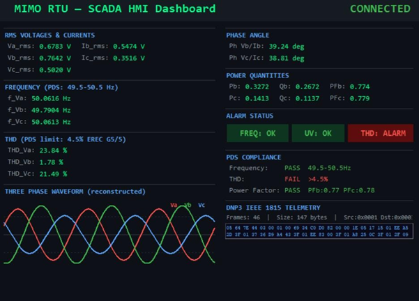
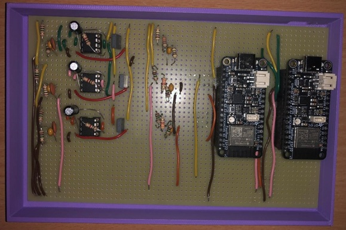
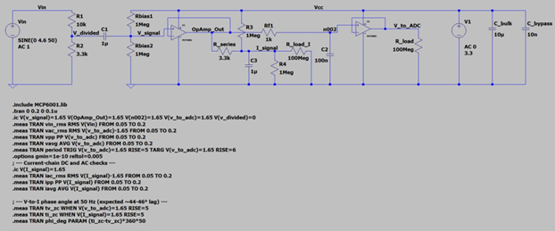
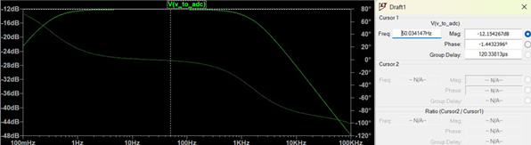
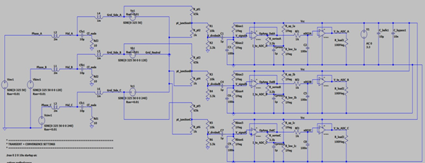
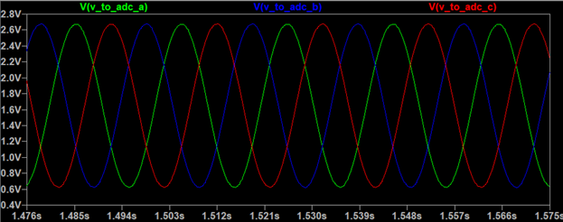

## SCADA Dashboard

  

---

## Hardware Implementation

### Single-Channel SISO Prototype

  

### Three-Phase MIMO Prototype

  

---

## Signal Conditioning Design

### Conditioning Circuit

  

### Frequency Response Bode Plot

  

---

## Three-Phase System Modelling

### MIMO + LCL System Schematic

  

### ADC-Ready Three-Phase Voltage Traces

  

